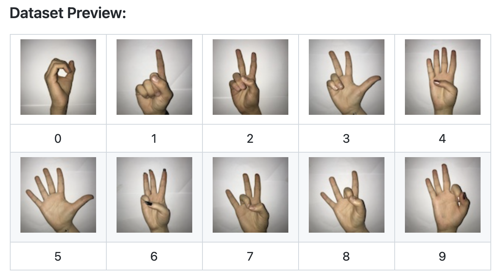
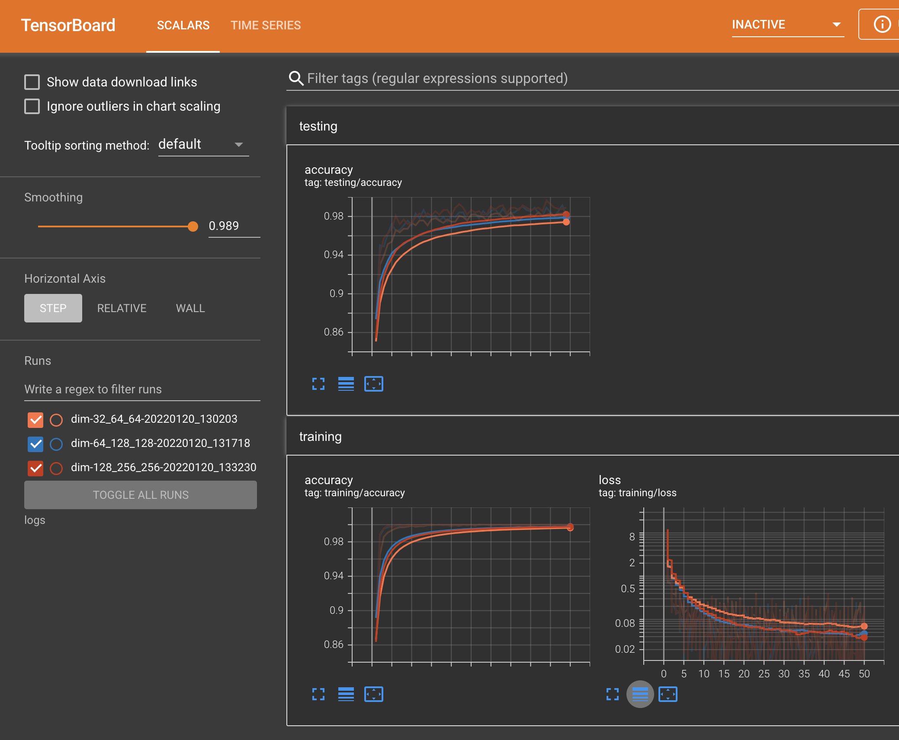

# ハンドサイン(数字)認識

- https://github.com/ardamavi/Sign-Language-Digits-Dataset




# 特徴

- PyTorch
- torchvision.transform を使ったデータの水増し(Data Argumentation)
- CUDA環境下ではGPUを使用した学習
- マルチプロセス、並列処理による高速な学習
- tensorboardによる学習状況閲覧



# Clone

```
git clone https://github.com/kose/Sign-Language-Digits.git
cd Sign-Language-Digits.git
git submodule update --init --recursive
```

# データセット

```
cd Sign-Language-Digits/db
./00make_dataset.sh

プレビュー
python dataset.py
```


# tensorboardを起動

```
./00server.sh
```

ブラウザで [http://localhost:6006/](http://localhost:6006/) を開く


# 学習

```
python train.py 
```

シェルスクリプト 00train.sh を見てください。

# 評価

```
> python test.py --model result/dim-32_64_64-20220120_130203.pt 
[[ 76   0   0   0   0   0   0   0   0   0]
 [  0  78   0   0   0   0   0   0   0   0]
 [  0   0  90   0   0   0   0   0   0   0]
 [  0   0   0 103   0   0   0   2   0   1]
 [  0   0   0   0  66   1   1   0   0   0]
 [  0   0   0   0   0  72   0   0   0   0]
 [  0   0   0   0   1   0  75   0   0   0]
 [  0   0   1   0   0   0   1  92   0   0]
 [  0   0   0   0   1   0   2   3  82   0]
 [  0   0   0   0   0   0   0   0   1  75]]
accuracy: 0.9817961165048543
```

# reference

- コードは https://github.com/pytorch/examples/tree/master/mnist_hogwild をベースにしている。
